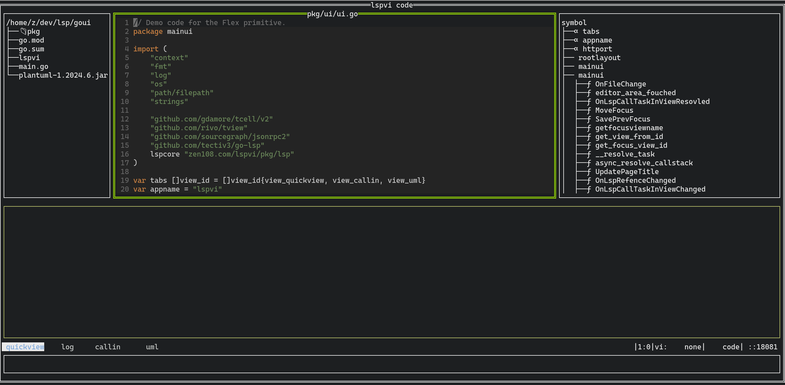
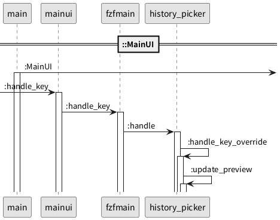
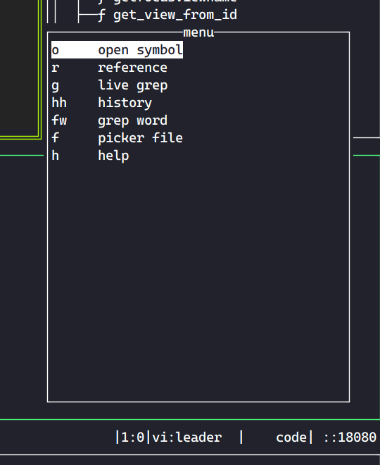
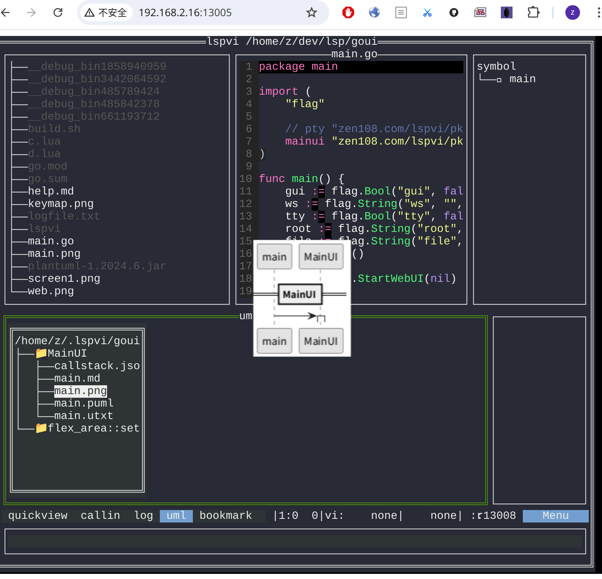

## About lspvi

lspvi is tui code reader powsered by lsp. **Just code reader not editor**

It provides goto define ,goto declaration, call hierarchy,reference  etc which also provided by common ide.

But compared with vscode,neovim ..., lspvi provide  more powerful function for call hierarchy,reference ...

It can prvoides **UML call sequence** which can help you to understand the code. 

It also support fzf search for files and text, symbol ,call reference,live grep, word grep. 

All above features are built in single binary not need to install plugin. Binary also includes built-in web server by which you can view uml in browser.

## Mouse Support
Although it run in terminal, it supports mouse click, wheel scrolling as well as gui. So if you are not vimer, it is also easy to use.

## Keymap 
It supports most of common keymap of [neo]vim. **Space** will invoke menu and  choose **help** or   **space + h** will invoke keymap help.

| key            | function               |
| -------------- | ---------------------- |
| escape + gd    | goto define            |
| escape + gr    | goto refer             |
| escape + gg    | goto first line        |
| escape + G     | goto first line        |
| escape + gd    | goto define            |
| escape + gr    | goto refer             |
| escape + gg    | goto first line        |
| escape + G     | goto first line        |
| space + f      | picker file            |
| space + fw     | grep word              |
| space + wk     | query workspace symbol |
| space + r      | reference              |
| space + hh     | history                |
| space + o      | open symbol            |
| o              | open symbol            |
| r              | reference              |
| g              | live grep              |
| hh             | history                |
| fw             | grep word              |
| f              | picker file            |
| h              | help                   |
| escape + k     | up                     |
| escape + h     | left                   |
| escape + l     | right                  |
| escape + j     | down                   |
| escape + e     | word right             |
| escape + b     | word left              |
| escape + D     | goto decl              |
| escape + gd    | goto define            |
| escape + f     | file in file           |
| escape + *     | file in file vi        |
| escape + c     | goto callin            |
| escape + r     | goto refer             |
| escape + /     | search mode            |
| escape + 0     | goto line head         |
| ctrlw+ l/r/u/d | switch window          |

## Code/Uml  view in browser
Because of the limitation of terminal, you can still view text call sequence in lspvi console. But if you want to view png clearly, , you can use browser to view  call sequence.

[http:://localhost:108080](http:://localhost:108080)

## lsp supported
- gopls
- clangd
- python

## Install
~~~sh
git submodule init  && git submodule update --recursive
pushd pkg/lspr
bash build.sh -w
popd
go build
./lspvi --root "prj root"
~~~

## platform /os 
- MACOS 
- linux 

